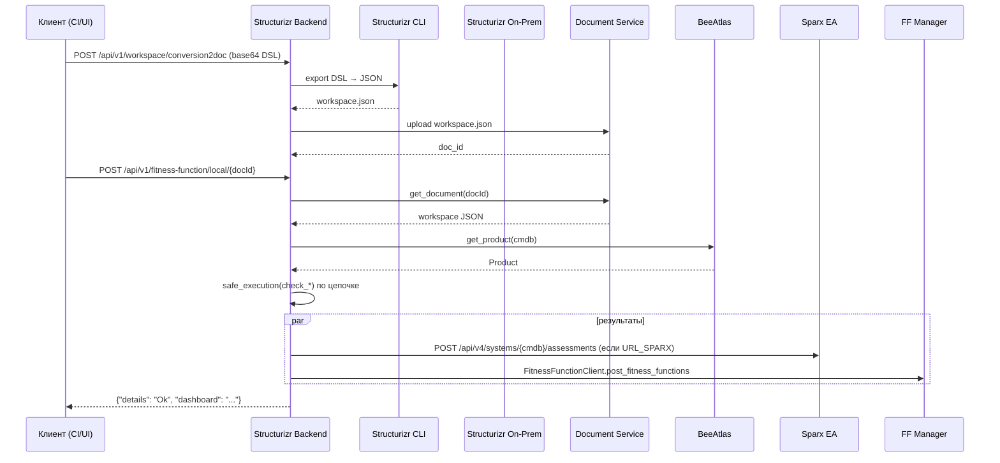
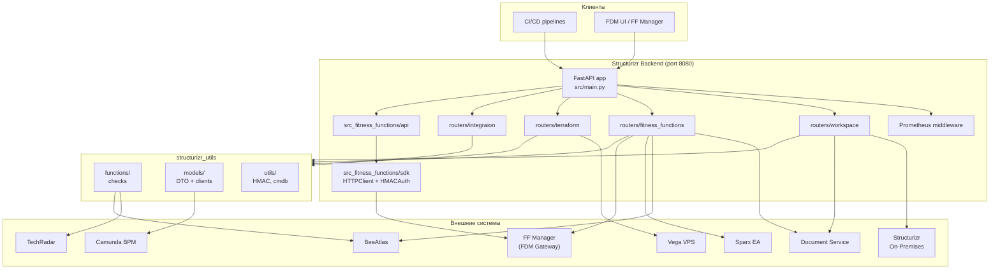

# REASON Canvas — Structurizr Backend (FastAPI)

## Метаданные

- Название: Structurizr Backend API — управляющий слой архитектурного конвейера VimpelCom (workspace, fitness functions, terraform, интеграции).
- Точка входа: [`src/main.py`](src/main.py), порт `8080`, контейнер собирается из [`Dockerfile`](Dockerfile) (Ubuntu 22.04 + JDK 21 + Python 3.10 + Structurizr CLI `v2025.11.09`).
- Связанные требования: автоматизация цикла `DSL → JSON → Document Service → Structurizr On-Premises → Fitness Functions → Sparx/FF Manager → Terraform/Vega VPS`; экспорт SLA из OpenAPI/WSDL/Proto; HMAC-SHA256 аутентификация для Structurizr On-Premises и FDM Gateway.
- **Структура документа (REASON Canvas):** разделы **R** (Requirements), **E** (Entities), **A** (Approach), **S** (Structure), **O** (Operations), **N** (Norms) и блок **Safeguards** — согласованное описание требований к сервису, контрактов, кода и эксплуатации.


---

## R — Requirements

Ниже перечислены **HTTP-эндпоинты** приложения. Источник истины — `@router.*` декораторы в [`src/routers/`](src/routers/) и подключение пакета [`src_fitness_functions/`](src_fitness_functions/) в [`src/main.py`](src/main.py). Префикс роутеров не задаётся в `APIRouter()`, все пути прописаны полностью в декораторах. `redirect_slashes` оставлен в значении по умолчанию (FastAPI: `True`), поэтому вариант с trailing slash перенаправляется на канонический путь без него.

### `/api/v1/workspace` — публикация и подготовка модели

| Метод | Путь | Назначение |
|-------|------|------------|
| POST | `/workspace`, `/api/v1/workspace` | Создание нового workspace в Structurizr для продукта BeeAtlas. Тело — `RestProduct` (`code`, `architect_name`). Ответ — `RestWorkspace` (`id`, `code`, `name`, `api_key`, `api_secret`, `api_url`). Конструирует пустой workspace из шаблона `templates/workspace.dsl`, патчит продукт в BeeAtlas. |
| POST | `/api/v1/workspace/validate` | Валидация DSL workspace (`base64` → Structurizr CLI export → JSON). Тело: `{"workspace": "<base64-dsl>"}`. Ответ `200`: `{"valid": "true"}`, ошибка `400` — `{"valid": "false", "error": "..."}`. |
| POST | `/api/v1/workspace/conversion` | Конвертация DSL → JSON без сохранения. Тело аналогично `/validate`. Ответ — workspace JSON в теле. |
| POST | `/api/v1/workspace/conversion2doc` | Конвертация DSL → JSON + сохранение в Document Service. Ответ: `{"doc_id": <int>}`. |
| POST | `/api/v1/workspace/{docId}` | Публикация ранее сохранённого workspace JSON в Structurizr On-Premises. Использует HMAC-SHA256 ключи из BeeAtlas. Ответ `201`: `{"details": "Ok", "workspace_id": "<id>"}`. |
| POST | `/api/v1/workspace/{docId}/fdm` | Полный цикл: загрузка из Document Service, fitness functions, отправка результатов в Sparx EA и в FF Manager (`FitnessFunctionClient`), публикация workspace в Structurizr. Ответ `201`: `{"details": "Ok"}`. |
| POST | `/api/v1/dsl2fdm` | То же, что `/fdm`, но на вход принимает DSL в base64, без предварительного сохранения документа. |

### `/api/v1/fitness-function` — локальные проверки fitness functions

| Метод | Путь | Назначение |
|-------|------|------------|
| POST | `/api/v1/fitness-function/local/{docId}` | Локальный прогон **агрегированного набора** проверок (`check_*` через `safe_execution`, см. [`fitness_functions.py`](src/routers/fitness_functions.py)) для уже сохранённого документа. Query: `pipelineId` (int, default `0`). При наличии `URL_SPARX` — публикация результатов в Sparx; параллельно через `FitnessFunctionClient` в FF Manager. Ответ `201`: `{"details": "Ok", "dashboard": "<url>"}`. |

Перечень проверяемых функций (через [`safe_execution`](src/structurizr_utils/functions/objects.py)):

| Код | Категория | Реализация |
|-----|-----------|------------|
| `EA-0001` | Соответствие IP-адресации сетевым политикам | [`ea_0001.py`](src/structurizr_utils/functions/ea_0001.py) |
| `CTX.01-03` | Контекстные диаграммы | [`context.py`](src/structurizr_utils/functions/context.py) |
| `CPB.01-05` | Business / Tech Capability | [`capability.py`](src/structurizr_utils/functions/capability.py) |
| `TECH.01-06` | Соответствие технологий TechRadar | [`technology.py`](src/structurizr_utils/functions/technology.py) |
| `SQ.01-02` | Sequence-диаграммы | [`sequences.py`](src/structurizr_utils/functions/sequences.py) |
| `DEP.01-04` | Diagram размещения | [`deployment.py`](src/structurizr_utils/functions/deployment.py) |
| `CNT.01-03` | Контейнерная модель | [`container.py`](src/structurizr_utils/functions/container.py) |
| `ADR.01` | Архитектурные решения | [`adr.py`](src/structurizr_utils/functions/adr.py) |
| `API.01-03` | API / SLA | [`api.py`](src/structurizr_utils/functions/api.py) |


### `/api/v1/ff` — FF Manager-совместимые эндпоинты (пакет [`src_fitness_functions/`](src_fitness_functions/))

Общий паттерн: тело с `callId: UUID`, `productCode: str`; для проверок по workspace — query `docId: int`; без `docId` — `501 Not Implemented` (кроме случаев, где явно иначе в коде). Ответы: `isCheck`, `details[]` (см. Pydantic-модели в `src_fitness_functions/api/ff_*.py` и раздел **E**).

| Метод | Путь | Назначение |
|-------|------|------------|
| GET | `/health` | Liveness/readiness для группы FF API. Ответ: `{"status": "ok"}`. |
| POST | `/api/v1/ff/adr01` | ADR.01 — в workspace есть ADR (`documentation.decisions`). |
| POST | `/api/v1/ff/api01` | API.01 — у приложения есть опубликованные API. |
| POST | `/api/v1/ff/api02` | API.02 — для части методов задан SLA. |
| POST | `/api/v1/ff/api03` | API.03 — для всех TC есть спецификация. |
| POST | `/api/v1/ff/cnt01` | CNT.01 — в модели есть контейнеры системы. |
| POST | `/api/v1/ff/cnt02` | CNT.02 — есть хотя бы одна диаграмма контейнеров. |
| POST | `/api/v1/ff/cnt03` | CNT.03 — вызовы между контейнерами с технологией. |
| POST | `/api/v1/ff/cpb01` | CPB.01 — TC в Structurizr и/или landscape (при `CAPABILITY_PRODUCT_ID` — GET Capability API `.../tech-capabilities/product/{id}`). |
| POST | `/api/v1/ff/cpb02` | CPB.02 — для контейнеров с внешним взаимодействием заданы TC. |
| POST | `/api/v1/ff/cpb03` | CPB.03 — в модели описаны technical capability в Structurizr. |
| POST | `/api/v1/ff/cpb04` | CPB.04 — позиционирование TC (родители без подстрок `dmn.` / `grp.` в коде); в деталях — `rule`, `reason`, `severity`. |
| POST | `/api/v1/ff/cpb05` | CPB.05 — качество описания TC по критерию 101 (PostgreSQL BeeAtlas, `FDMDB_*`); `productCode` → `p.Alias` в SQL. |
| POST | `/api/v1/ff/ctx01` | CTX.01 — есть `systemContextView` для системы с `properties.cmdb` = `productCode`. |
| POST | `/api/v1/ff/ctx02` | CTX.02 — у связей системы на контексте задано `description` (если диаграммы нет — проверка не требуется, `isCheck: true`). |
| POST | `/api/v1/ff/ctx03` | CTX.03 — у связей задана `technology`; в деталях — `target_name` и `technology`. |
| POST | `/api/v1/ff/dep01` | DEP.01 — есть Deployment Environment (`deploymentNodes[].environment`). |
| POST | `/api/v1/ff/dep02` | DEP.02 — есть deployment-диаграмма (`deploymentViews`). |
| POST | `/api/v1/ff/dep03` | DEP.03 — узлы развёртывания сверяются с CMDB (Products API, `URL_PRODUCTS`). |
| POST | `/api/v1/ff/dep04` | DEP.04 — макросегментация Protected/DMZ и зоны. |
| POST | `/api/v1/ff/ea0001` | EA.0001 — выход в интернет: внешний IP, `external_ip` или host `*.beeline.ru` на deployment-узлах. |
| POST | `/api/v1/ff/git01` | GIT.01 — у контейнеров системы URL git/nexus/harbor (TechRadar — исключение инфраструктурных). |
| POST | `/api/v1/ff/sq01` | SQ.01 — для TC из Products API есть `dynamicView` (`URL_PRODUCTS`). |
| POST | `/api/v1/ff/sq02` | SQ.02 — на sequence TC REST-связи с HTTP-методом в `description`. |
| POST | `/api/v1/ff/tech01` | TECH.01 — технологии продукта в TechRadar. |
| POST | `/api/v1/ff/tech02` | TECH.02 — нет технологий в статусе HOLD. |
| POST | `/api/v1/ff/tech03` | TECH.03 — у контейнеров заданы технологии. |
| POST | `/api/v1/ff/tech04` | TECH.04 — нет протоколов в статусе hold. |
| POST | `/api/v1/ff/tech05` | TECH.05 — протоколы взаимодействий из TechRadar. |
| POST | `/api/v1/ff/tech06` | TECH.06 — технологии из мониторинга/Git в архитектуре. |

Реализация: [`src/main.py`](src/main.py) подключает роутеры из [`src_fitness_functions/api/`](src_fitness_functions/api/); для CPB — разбор workspace и вызовы внешних API только через [`beeatlas_api.py`](src_fitness_functions/beeatlas_api.py) и БД в [`sdk/capability_utils.py`](src_fitness_functions/sdk/capability_utils.py) (без импорта `structurizr_utils` в CPB-слое).

### `/api/v1/workspace/.../terraform` — генерация Terraform

| Метод | Путь | Назначение |
|-------|------|------------|
| GET | `/api/v1/workspace/{docId}/terraform` | Генерация Terraform HCL из сохранённого документа. Query: `token` (Vega VPS JWT), `environment`. Ответ — `text/plain` HCL. |
| POST | `/api/v1/workspace/terraform/generate` | Генерация Terraform HCL из переданного workspace JSON (raw body). Header `X-Token` — Vega VPS JWT. Query: `environment`. |

Поддерживаемые типы ресурсов: `Vm` → `vega_server`, `PostgreSQL` → `vega_postgresql`, `MongoDB` → `vega_mongodb`, `Redis` → `vega_redis`, `KafkaCluster` → `vega_kafka_cluster` + `vega_kafka_topic` (см. [`model_terraform.py`](src/structurizr_utils/models/model_terraform.py), шаблон [`templates/terraform/main.jinja`](templates/terraform/main.jinja)).

### `/api/v1/integration` — расчёт SLA

| Метод | Путь | Назначение |
|-------|------|------------|
| POST | `/api/v1/integration/sla` | Расчёт SLA из спецификации API. Тело — raw text (`OpenAPI/Swagger`, `WSDL`, `Protocol Buffers`). Ответ — `text/plain` со строками вида `"GET /api/users" rps=25;latency=150;error_rate=0.1`. В текущей реализации значения генерируются случайно (`get_sla_from_parser` в [`routers/integraion.py`](src/routers/integraion.py)); закомментированный код заготовлен под LLM (RuadaptQwen / DeepSeek). |

### Служебные эндпоинты

| Метод | Путь | Назначение |
|-------|------|------------|
| GET | `/actuator/prometheus` | Метрики Prometheus в текстовом формате (`http_requests_total`, `http_request_duration_seconds`). Запросы к этому пути не учитываются в счётчиках — исключаются в middleware и в `uvicorn.access` логе. |
| GET | `/docs`, `/redoc`, `/openapi.json` | OpenAPI документация (FastAPI). Кастомизация заголовка/версии в [`custom_openapi`](src/main.py). |

**Общие нефункциональные ожидания к API:**

- OpenAPI/Swagger UI (`/docs`, `/redoc`) — включены автоматически FastAPI.
- Валидация тел — Pydantic v2 (см. [`requirements/base.txt`](requirements/base.txt)).
- Сбор метрик HTTP — middleware с Prometheus `Counter`/`Histogram` в [`src/main.py`](src/main.py).
- Глобальный обработчик `RequestValidationError` → `400 {"detail": "Some of parameters is empty or missing"}`.
- Для долгих операций (Structurizr CLI export/push, `check-ai`, генерация Terraform) ограничения по таймауту в коде не выставлены; контейнер запускается без явного worker-таймаута uvicorn — учитывать при балансировке/ингрессе.

---

## E — Entities

Источник полей — Pydantic-модели в [`src/structurizr_utils/models/`](src/structurizr_utils/models/) и [`src_fitness_functions/`](src_fitness_functions/). База данных не используется: модели — это **DTO/контракты** для REST-вызовов внешних систем и тел эндпоинтов.

### Core REST DTO (запросы/ответы Structurizr Backend)

#### `RestProduct` ([`models_workspace.py`](src/structurizr_utils/models/models_workspace.py))

| Поле | Тип | Описание |
|------|-----|----------|
| code | str | CMDB-код продукта в BeeAtlas |
| architect_name | str | Имя архитектора (для шаблона workspace) |

#### `RestWorkspace` ([`models_workspace.py`](src/structurizr_utils/models/models_workspace.py))

| Поле | Тип | Описание |
|------|-----|----------|
| id | int | ID workspace в Structurizr On-Premises |
| code | str | CMDB-код продукта |
| name | str | Имя workspace |
| api_key | str | API-ключ Structurizr (HMAC) |
| api_secret | str | API-секрет Structurizr (HMAC) |
| api_url | str | Публичный URL workspace |

#### `DSLWorkspace` ([`routers/utils.py`](src/routers/utils.py))

`TypedDict { workspace: str }` — DSL workspace в виде base64-строки UTF-8.

#### `SuccessResponse` ([`routers/fitness_functions.py`](src/routers/fitness_functions.py))

| Поле | Тип | Описание |
|------|-----|----------|
| details | str | Текстовая метка результата (`"Ok"`) |
| workspace_id | str, optional | ID опубликованного workspace |
| dashboard | str, optional | Ссылка на dashboard FF Manager |

#### `Adr01Request` / `Adr01Response` / `AdrDetail` ([`src_fitness_functions/api/ff_adr_01.py`](src_fitness_functions/api/ff_adr_01.py))

Адаптер для FF Manager. `Adr01Request` содержит `callId: UUID`, `productCode: str`. Ответ — список `AdrDetail` (`code`, `name`, `date`, `status`, `check`).

#### CTX.01–CTX.03 ([`src_fitness_functions/api/ff_ctx_01.py`](src_fitness_functions/api/ff_ctx_01.py) … [`ff_ctx_03.py`](src_fitness_functions/api/ff_ctx_03.py))

Контракт как у ADR/CNT: `callId`, `productCode`, `docId`. Детали — `code`, `name`, `date` (`properties.modified` системы), `status`, `check`. Разбор workspace — [`sdk/context_utils.py`](src_fitness_functions/sdk/context_utils.py) (без `structurizr_utils`). **CTX.01** — по одной строке на каждый `systemContextView` (`code` = `key` диаграммы). **CTX.02** / **CTX.03** — по каждой связи целевой системы на контекстной диаграмме: сначала строки с `check: true` (есть `description` / `technology`), затем с `check: false`; у **CTX.03** в деталях — `target_name` и `technology` (найденное значение из связи). При отсутствии контекстной диаграммы CTX.02/03 возвращают одну сводную строку `check: true` (связи не анализируются, как в `check_context`).

#### DEP.01–DEP.03 ([`src_fitness_functions/api/ff_dep_01.py`](src_fitness_functions/api/ff_dep_01.py) … [`ff_dep_03.py`](src_fitness_functions/api/ff_dep_03.py))

Контракт как у ADR/CTX: `callId`, `productCode`, `docId`. Разбор workspace — [`sdk/deployment_utils.py`](src_fitness_functions/sdk/deployment_utils.py) (без `structurizr_utils`). **DEP.01** — по одной строке на каждый уникальный `deploymentEnvironment` среди корневых `deploymentNodes` (`code` и `name` = значение `environment`). **DEP.02** — по каждой `deploymentView` (`code` = `key`, `name` = `title`). **DEP.03** — сверка VM-узлов и k8s namespace (`properties.type` содержит `k8s`) с CMDB через Products API (`BeeAtlasAPI.fetch_product_infra_parents`, `URL_PRODUCTS`); потомки k8s-узла не проверяются; в `details` сначала строки `check: true`, затем `check: false`; при не заданном `URL_PRODUCTS` — одна строка `status: SKIP`, `check: true`. DEP.04 — заглушка.

#### EA.0001 ([`src_fitness_functions/api/ff_ea_0001.py`](src_fitness_functions/api/ff_ea_0001.py))

Контракт как у ADR: `callId`, `productCode`, `docId`. Разбор workspace — [`sdk/ea_utils.py`](src_fitness_functions/sdk/ea_utils.py) (как [`ea_0001.py`](src/structurizr_utils/functions/ea_0001.py)). Обход поддерева каждого корневого `deploymentEnvironment`: внешний IP в `properties.ip`, `properties.external_ip` или host `*.beeline.ru`. В `details` — **по одной строке на каждый уникальный environment** (`code` = environment, `status`/`check`: `OK`/`true` при выходе в интернет на стенде, иначе `FAIL`/`false`); сначала стенды с выходом, затем без. `isCheck: true`, если хотя бы на одном стенде есть признак выхода в интернет.

#### TECH.01–TECH.06 ([`src_fitness_functions/api/ff_tech_01.py`](src_fitness_functions/api/ff_tech_01.py) … [`ff_tech_06.py`](src_fitness_functions/api/ff_tech_06.py))

Контракт как у ADR: `callId`, `productCode`, `docId`. TechRadar — [`techradar_cache.py`](src_fitness_functions/api/techradar_cache.py) (read-through, TTL 15 мин) и [`beeatlas_api.py`](src_fitness_functions/beeatlas_api.py); разбор workspace — [`sdk/technology_utils.py`](src_fitness_functions/sdk/technology_utils.py) (как [`technology.py`](src/structurizr_utils/functions/technology.py)). **TECH.01** — технологии контейнеров (не `source=landscape`) в TechRadar. **TECH.02** — нет HOLD у технологий контейнеров. **TECH.03** — у контейнеров задано `technology`. **TECH.04** — нет HOLD у протоколов связей контейнеров. **TECH.05** — протоколы связей из TechRadar. **TECH.06** — технологии мониторинга (`product-tech`) есть в архитектуре. При недоступном TechRadar — `status: SKIP`. В `details` сначала `check: true`, затем `check: false` (где применимо).

#### GIT.01 ([`src_fitness_functions/api/ff_git_01.py`](src_fitness_functions/api/ff_git_01.py))

Контракт как у ADR: `callId`, `productCode`, `docId`. Разбор — [`sdk/git_utils.py`](src_fitness_functions/sdk/git_utils.py) (ветка GIT.01 из [`container.py`](src/structurizr_utils/functions/container.py)). По каждому контейнеру целевой системы (не `external`, не инфраструктурный по TechRadar): `code` = id контейнера, `name` = имя сервиса (контейнера), `git` = URL репозитория (`git` / `nexus` / `harbor`); в `details` сначала `check: true`, затем `check: false`. TechRadar — `BeeAtlasAPI.fetch_techradar_infrastructure_labels` (`URL_TECHRADAR`).

#### SQ.01–SQ.02 ([`src_fitness_functions/api/ff_sq_01.py`](src_fitness_functions/api/ff_sq_01.py), [`ff_sq_02.py`](src_fitness_functions/api/ff_sq_02.py))

Контракт как у ADR. **SQ.01** — TC из Products API (`fetch_product_containers`, `URL_PRODUCTS`) должны иметь `dynamicView` с `key`, совпадающим с кодом TC (полный или короткий суффикс после `.`); в деталях: `code` — полный код TC с префиксом `productCode`; для найденной диаграммы — `name` (имя dynamic-диаграммы) и `plantUML` (сценарий PlantUML sequence); для TC без диаграммы — только `code`, `date`, `status`, `check` (без `name` и `plantUML`); сначала найденные sequence, затем отсутствующие TC. **SQ.02** — только dynamic-диаграммы, связанные с TC из Products API; по каждому REST-вызову (`HTTP`/`HTTPS`/`REST`) в `description` должен быть HTTP-метод (`GET`/`POST`/…); `code` — полный код TC с префиксом `productCode`, `name` — id связи, описание и technology; сначала корректные вызовы, затем ошибки. При не заданном `URL_PRODUCTS` — `status: SKIP` для SQ.01; SQ.02 при отсутствии TC — одна строка `check: true`. Логика — [`sdk/sequence_utils.py`](src_fitness_functions/sdk/sequence_utils.py) (как [`sequences.py`](src/structurizr_utils/functions/sequences.py)).

#### CPB.01–CPB.05 ([`src_fitness_functions/api/ff_cpb_01.py`](src_fitness_functions/api/ff_cpb_01.py) … [`ff_cpb_05.py`](src_fitness_functions/api/ff_cpb_05.py))

Тот же контракт, что у ADR.01: тело с `callId`, `productCode`, query `docId` (без `docId` — `501`). Ответы: `Cpb0xResponse` со списком деталей; для **CPB.01** элементы `Cpb01Detail` — поля `code`, `name`, `source` (Landscape / Structurizr / FAIL), `parents` (массив `{"code": "..."}`), `check`. Для **CPB.02** дополнительно `container_name`, `technical_capability`, `external_callers` (один внешний участник на строку); в `details` — **по каждой внешней связи** контейнера: сначала строки с полной TC (`check: true`, `status: OK`), затем связи без полной TC (`check: false`, `status: FAIL`); если контейнеров с внешним взаимодействием нет — одна сводная строка. Для **CPB.03** формат как у **CPB.01** (`code`, `name`, `source`, `parents`, `check`): сначала полные TC (`code` + `parents`, `check: true`), затем неполные компоненты `type=capability` без `code` и/или `parents` (`check: false`); `isCheck` — есть ли хотя бы одна полная TC. Для **CPB.04** — `code`, `name`, `status`, `check`, а также `rule` (например `CPB.04`, `CPB.04_PARENT_DMN`, `CPB.04_PARENT_GRP` или комбинация через `+`), `reason`, `severity` (`ok` / `error`). Для **CPB.05** — `code`, `name`, `status`, `check`; при неполных или пустых `FDMDB_*` запрос к PostgreSQL не выполняется — в `details` одна строка со `status: SKIP`, `check: true` и пояснением в `name` (список отсутствующих переменных). Разбор workspace, HTTP к Document Service / Capability и внешние переменные — в [`src_fitness_functions/sdk/capability_utils.py`](src_fitness_functions/sdk/capability_utils.py) и [`beeatlas_api.py`](src_fitness_functions/beeatlas_api.py) (без импортов `structurizr_utils`). Дополнительно: `CAPABILITY_API_URL` (по умолчанию как в `CapabilityClient`), `CAPABILITY_PRODUCT_ID` — числовой id продукта в FDM для ветки landscape в CPB.01; `FDMDB_SERVER`, `FDMDB_DB`, `FDMDB_USERNAME`, `FDMDB_PASS` — для CPB.05.

### Доменные модели BeeAtlas (`models_product.py`)

Полный список (более 60 классов) — в [`src/structurizr_utils/models/models_product.py`](src/structurizr_utils/models/models_product.py). Ключевые:

| Модель | Назначение |
|--------|------------|
| `Product` | Продукт BeeAtlas: `id`, `alias`, `name`, `gitUrl`, `structurizrApi{Key,Secret,Url,WorkspaceName}`, `techProducts[]`, `discoveredInterfaces[]`. |
| `TechProduct`, `TechDTO`, `ProductTechRelationDTO` | Связь продукта с технологиями TechRadar. |
| `DiscoveredInterface`, `DiscoveredOperation`, `DiscoveredParameter` | Обнаруженные API-интерфейсы продукта. |
| `Interface`, `ContainerDTO`, `ProductInterfaceDTO`, `MapicInterfaceDTO` | Связи на уровне контейнеров и MAPIC. |
| `FitnessFunctionDTO`, `FitnessFunctionResponseDTO`, `AssessmentResponseDTO` | Контракты публикации результатов в FF Manager (`FitnessFunctionClient`). |
| `FitnessFunctionClient` | HTTP-клиент к FF Manager (через FDM Gateway). |

### Модели Terraform (`model_terraform.py`)

| Модель | Vega-провайдер |
|--------|----------------|
| `Vm` | `vega_server` |
| `PostgreSQL` | `vega_postgresql` |
| `MongoDB` | `vega_mongodb` |
| `Redis` | `vega_redis` |
| `KafkaCluster` | `vega_kafka_cluster` + `vega_kafka_topic` |
| `GeneralResource` | дженерик для остальных типов |
| `Resources` | контейнер: `List[Union[Vm, PostgreSQL, MongoDB, Redis, KafkaCluster, GeneralResource]]` |

### Клиенты внешних систем

| Клиент | Файл | Назначение |
|--------|------|------------|
| `VegaVPSClient` | [`model_vega_vps.py`](src/structurizr_utils/models/model_vega_vps.py) | Vega VPS API (flavors, images, regions, servers, volumes). |
| `TechradarClient` | [`model_techradar.py`](src/structurizr_utils/models/model_techradar.py) | TechRadar (категории, технологии, кольца). |
| `CapabilityClient` | [`model_capability.py`](src/structurizr_utils/models/model_capability.py) | Business / Tech Capability API. |
| `GraphService` | [`model_graph.py`](src/structurizr_utils/models/model_graph.py) | Архитектурный граф (диаграммы, влияния). |
| `CamundaClient` | [`model_camunda.py`](src/structurizr_utils/models/model_camunda.py) | Camunda BPM. |
| `ObservabilityClient` | [`model_observability.py`](src/structurizr_utils/models/model_observability.py) | Observability сервис. |
| `RuleCompilerClient` | [`model_rule_compiler.py`](src/structurizr_utils/models/model_rule_compiler.py) | Rule Compiler. |
| `SystemServiceClient` | [`model_system_service.py`](src/structurizr_utils/models/model_system_service.py) | SystemService (методы, SLA, мониторинг). |
| `DocumentService` | [`model_documents.py`](src/structurizr_utils/models/model_documents.py) | Document Service (`upload_workspace_json`, `get_document`). |
| `FitnessFunctionClient` | [`models_product.py`](src/structurizr_utils/models/models_product.py) | Публикация результатов fitness functions в FF Manager / FDM Gateway. |
| `HTTPClient` + `HMACAuth/JWTAuth/NoAuth` | [`src_fitness_functions/sdk/`](src_fitness_functions/sdk/) | Унифицированный SDK для вызовов FDM Gateway (retries, HMAC-SHA256, типизированные исключения). |

### Конфигурация (`Settings`)

[`src_fitness_functions/config.py`](src_fitness_functions/config.py) — `pydantic_settings.BaseSettings`:

| Поле | Env-переменная | Назначение |
|------|----------------|------------|
| gateway_url | `GATEWAY_URL` | Базовый URL FDM Gateway для SDK. |
| api_key | `API_KEY` | API-ключ FDM Gateway (HMAC). |
| api_secret | `API_SECRET` | API-секрет FDM Gateway (HMAC). |

Загружается из `.env`/`.env_dev` в корне репозитория (`extra="ignore"` — посторонние переменные не ломают валидацию). Прочие URL читаются напрямую через `os.getenv(...)` в [`src/structurizr.py`](src/structurizr.py), [`src/routers/terraform.py`](src/routers/terraform.py), интеграционных клиентах. Для эндпоинтов CPB в `src_fitness_functions` дополнительно: `CAPABILITY_API_URL`, `CAPABILITY_PRODUCT_ID`, `FDMDB_SERVER`, `FDMDB_DB`, `FDMDB_USERNAME`, `FDMDB_PASS` — для CPB.05 все четыре `FDMDB_*` должны быть **непустыми**; перед запросом к БД подгружаются незаданные в процессе ключи из `.env`/`.env_dev` (если установлен `python-dotenv`, см. [`capability_utils.py`](src_fitness_functions/sdk/capability_utils.py)).

### Диаграмма потока публикации (DSL → FDM)



---

## A — Approach

- **Один FastAPI-процесс**, роутеры группируются по доменам (`workspace`, `fitness_functions`, `terraform`, `integraion`). Дополнительный пакет [`src_fitness_functions/`](src_fitness_functions/) предоставляет HTTP-эндпоинты, совместимые с FF Manager, и единый SDK (`HTTPClient` + `HMACAuth`) для походов в FDM Gateway. Пакет подключается в `src/main.py` через `sys.path.insert(0, _PROJECT_ROOT)` — оба пути живут в одной точке входа и одном `OpenAPI`.
- **Хранение состояния отсутствует**: backend stateless. Источник истины по продуктам — BeeAtlas, по архитектурным документам — Document Service, по моделям — Structurizr On-Premises. Локально создаются только временные файлы DSL/JSON в `tempfile.gettempdir()` (с удалением после публикации).
- **Структурный путь конвертации** идёт через **Structurizr CLI** (`/usr/local/structurizr-cli/structurizr.sh export/push`) — внутрь образа кладётся официальный CLI `v2025.11.09` (см. [`Dockerfile`](Dockerfile)). Это снимает необходимость воспроизводить парсер DSL на Python.
- **Аутентификация во внешние системы**: HMAC-SHA256 (Structurizr On-Premises — [`src/structurizr.py`](src/structurizr.py); FDM Gateway — [`src_fitness_functions/sdk/auth.py`](src_fitness_functions/sdk/auth.py)); JWT (Vega VPS, токен в `Header` или query); пароль (legacy `ONPREMISES_PASSWORD`). Чувствительные значения — только в `.env`/секретах CI, не в коде.
- **Fitness functions** — две поверхности: (1) агрегированный прогон в [`routers/fitness_functions.py`](src/routers/fitness_functions.py) — чистые функции в [`structurizr_utils/functions/`](src/structurizr_utils/functions/), обёрнутые в `safe_execution` (исключения не пробрасываются наружу, при ошибке — `Assessment` с `isCheck=False`); (2) отдельные HTTP-адаптеры под FF Manager в [`src_fitness_functions/api/`](src_fitness_functions/api/) (`ff_*`), без импорта `structurizr_utils` в CPB-слое — логика workspace/Capability API/БД в [`sdk/capability_utils.py`](src_fitness_functions/sdk/capability_utils.py). **Исходящий HTTP** к Document Service, Capability backend и произвольным URL спецификаций (OpenAPI и т.д.) внутри `src_fitness_functions` централизован в [`beeatlas_api.py`](src_fitness_functions/beeatlas_api.py) — см. норму в разделе **N**. Это позволяет вызывать проверки по одной из FF Manager и при этом сохранить прежний локальный «комбайн» `/api/v1/fitness-function/local/{docId}`.
- **Шаблонизация инфраструктуры** — Jinja2 (`templates/workspace.dsl`, `templates/terraform/main.jinja`). Изменения в DSL/HCL — через шаблоны, не через конкатенацию строк.
- **Метрики и логи**: Prometheus middleware считает `http_requests_total` и `http_request_duration_seconds` на каждый запрос (исключая `/actuator/prometheus`); логи структурированы через декораторы в [`src/routers/__init__.py`](src/routers/__init__.py) (`log_endpoint_call`, `log_key_milestone`, `log_error_with_details`, `log_function_entry/exit`).

---

## S — Structure

Корень репозитория **`structurizr-backend/`**:

| Путь | Назначение |
|------|------------|
| [`Dockerfile`](Dockerfile) | Production-образ: Ubuntu 22.04 + JDK 21 JRE + Python 3.10 + Graphviz + Structurizr CLI `v2025.11.09`. `CMD ["python3", "/opt/structurizr_backend/src/main.py"]`. |
| [`Dockerfile.test`](Dockerfile.test) | То же базовое содержимое, но `ENTRYPOINT ["/usr/bin/bash"]` — для ручных smoke и интеграционных тестов внутри контейнера. |
| [`docker-compose.yml`](docker-compose.yml) | Поднимает контейнер `structurizr_backend` с пробросом `8080:8080`, монтированием рабочей копии и `env_file: ".env_dev"`. |
| [`requirements/base.txt`](requirements/base.txt) | Python-зависимости (FastAPI 0.133, Uvicorn 0.35, Pydantic 2.12 + pydantic-settings 2.10, requests 2.32, Jinja2 3.1, PyYAML 6.0, zeep 4.2, pycamunda 0.6, psycopg2-binary 2.9, prometheus_client 0.21, PyJWT 2.10, pika 1.3, graphviz2drawio 1.1). |
| [`requirements/dev.txt`](requirements/dev.txt) | Зависимости для тестов и локальной разработки с полным импортом `main`: `base.txt` (частично продублировано с ослабленными пинами под Python 3.13) + `pytest`, `pytest-cov`, `httpx`, `python-dotenv`. |
| [`pytest.ini`](pytest.ini) | Конфигурация pytest: `testpaths=tests`, маркер `integration`. |
| [`.env`](.env), [`.env_dev`](.env_dev) | URL внешних систем и пароли. Не коммитить реальные секреты. |
| [`install_cert.sh`](install_cert.sh) | Установка корпоративных корневых сертификатов в системный bundle (для прокси/MITM-инспекции). |
| [`certs/`](certs/) | PEM/CRT для встройки в Docker-образ (`update-ca-certificates`). |
| [`templates/`](templates/) | Jinja2-шаблоны: `workspace.dsl`, `terraform/main.jinja`. |
| [`tests/`](tests/) | Автоматические тесты на pytest + `TestClient` и ручной интеграционный скрипт `run_conversion2doc_fdm.py`. См. подробности ниже. |
| [`.bumpversion.cfg`](.bumpversion.cfg) | SemVer-версионирование через `bumpversion`. |
| [`README.md`](README.md) | Этот документ. |

Каталог **[`tests/`](tests/)** — автотесты pytest:

| Файл | Назначение |
|------|------------|
| [`conftest.py`](tests/conftest.py) | sys.path для `src/` и `src_fitness_functions/`; обязательные env-переменные; in-memory `FakeDocumentStore`; фикстуры `client`, `workspace_json`, `workspace_dsl_b64`, `fake_product`/`fake_product_without_workspace`, `uploaded_doc_id` (заливает тестовый workspace.dsl через `/api/v1/workspace/conversion2doc` и возвращает `doc_id`); autouse-фикстура `patch_external_services` подменяет Document Service, BeeAtlas, Structurizr CLI, Sparx, FF Manager, Vega VPS, SDK FDM Gateway. |
| [`test_health_and_metrics.py`](tests/test_health_and_metrics.py) | `/health`, `/actuator/prometheus`, `/openapi.json` (сверяет наличие всех маршрутов из раздела R). |
| [`test_workspace.py`](tests/test_workspace.py) | `validate`, `conversion`, `conversion2doc` (включая два вызова с разными `doc_id`), `POST /workspace`, `POST /api/v1/workspace` (создание для свежего продукта, 400/404/422). |
| [`test_fitness_functions.py`](tests/test_fitness_functions.py) | Использует `uploaded_doc_id`: `/api/v1/workspace/{docId}`, `/api/v1/workspace/{docId}/fdm`, `/api/v1/dsl2fdm`, `/api/v1/fitness-function/local/{docId}` (плюс ошибки 404/409). |
| [`test_terraform.py`](tests/test_terraform.py) | `GET /api/v1/workspace/{docId}/terraform`, `POST /api/v1/workspace/terraform/generate`. |
| [`test_integration_sla.py`](tests/test_integration_sla.py) | `POST /api/v1/integration/sla`. |
| [`test_ff_adr_01.py`](tests/test_ff_adr_01.py) | `/health` и `POST /api/v1/ff/adr01` пакета `src_fitness_functions` (501 без `docId`, 200 с `docId`, 404 при NotFoundError, валидация UUID). |
| [`workspace.dsl`](tests/workspace.dsl), [`workspace.json`](tests/workspace.json) | Фикстуры реального workspace; CMDB-код продукта — `FDMSHOWCASEAPP`. |
| [`run_conversion2doc_fdm.py`](tests/run_conversion2doc_fdm.py) | Ручной интеграционный прогон против запущенного backend (не pytest). |

Каталог **[`src/`](src/)** — исполняемый код сервиса:

| Файл/папка | Назначение |
|------------|------------|
| [`main.py`](src/main.py) | Точка входа: создание `FastAPI`, Prometheus middleware, добавление корня репозитория в `sys.path`, подключение роутеров (`workspace`, `fitness_functions`, `terraform`, `integraion`, `ff_health_router`, роутеры `ff_*` из `src_fitness_functions/api/` — ADR, CPB, CNT, CTX, DEP, API, TECH и др.), кастомный обработчик `RequestValidationError`, кастомизация OpenAPI, фильтр логов `uvicorn.access` для `/actuator/prometheus`. `uvicorn.run(app, host="0.0.0.0", port=8080)`. |
| [`structurizr.py`](src/structurizr.py) | Низкоуровневый клиент Structurizr On-Premises: HMAC-SHA256, `load_workspace`, `post_workspace`, `get_workspaces`, `get_workspace_cmdb`. ENV: `URL_ONPREMISES_BASE`, `URL_ONPREMISES_WORKSPACE`, `ONPREMISES_PASSWORD`. |
| [`routers/__init__.py`](src/routers/__init__.py) | Декораторы и хелперы логирования: `log_endpoint_call`, `log_key_milestone`, `log_error_with_details`, `log_function_entry/exit`, `log_http_request/response`. |
| [`routers/workspace.py`](src/routers/workspace.py) | Эндпоинты `/workspace`, `/api/v1/workspace`, `/api/v1/workspace/validate`, `/api/v1/workspace/conversion`, `/api/v1/workspace/conversion2doc`. |
| [`routers/fitness_functions.py`](src/routers/fitness_functions.py) | `/api/v1/workspace/{docId}`, `/api/v1/workspace/{docId}/fdm`, `/api/v1/dsl2fdm`, `/api/v1/fitness-function/local/{docId}`; helper `publish_json_workspace`. |
| [`routers/terraform.py`](src/routers/terraform.py) | `GET /api/v1/workspace/{docId}/terraform`, `POST /api/v1/workspace/terraform/generate`; генерация HCL через шаблон + VegaVPS клиент. |
| [`routers/integraion.py`](src/routers/integraion.py) | `POST /api/v1/integration/sla` (REST/WSDL/Proto через `ApiLoader`). Имя файла содержит опечатку (`integraion` вместо `integration`) — исторически. |
| [`routers/utils.py`](src/routers/utils.py) | `decode_base64`, `convert_dsl2json` (через Structurizr CLI subprocess), типы `DSLWorkspace`, `ValidationError`, `ErrorDetail`. |
| [`structurizr_utils/`](src/structurizr_utils/) | Внутренняя «библиотека»: `functions/` — fitness checks (см. таблицу в R), `models/` — Pydantic-DTO и API-клиенты, `utils/` — общие хелперы (HMAC, `get_workspace_cmdb`). Подробная документация в [`src/structurizr_utils/readme.md`](src/structurizr_utils/readme.md) и [`src/structurizr_utils/models/README.md`](src/structurizr_utils/models/README.md). |

Каталог **[`src_fitness_functions/`](src_fitness_functions/)** — отдельный пакет fitness functions для FF Manager:

| Путь | Назначение |
|------|------------|
| [`__init__.py`](src_fitness_functions/__init__.py) | Маркер пакета. |
| [`main.py`](src_fitness_functions/main.py) | Standalone-запуск этого пакета на `8080` (для разработки без основного `src/main.py`). В прод-пути **не импортируется**. |
| [`config.py`](src_fitness_functions/config.py) | `Settings(BaseSettings)` — `gateway_url`, `api_key`, `api_secret`. Читает `.env`/`.env_dev` через `SettingsConfigDict(env_file=..., extra="ignore")`. |
| [`beeatlas_api.py`](src_fitness_functions/beeatlas_api.py) | Единая точка **исходящего HTTP** для FF-пакета: Document Service, Capability/Products API, TechRadar (`fetch_all_tech`, `fetch_product_tech`, `fetch_techradar_infrastructure_labels`), произвольные GET для спецификаций; `get_beeatlas_api()`, `get_workspace_json_cached`. |
| [`api/document_cache.py`](src_fitness_functions/api/document_cache.py) | Кеш workspace по `docId` (TTL 15 мин, read-through); внутри вызывает `BeeAtlasAPI.get_workspace_document`. |
| [`api/techradar_cache.py`](src_fitness_functions/api/techradar_cache.py) | Кеш TechRadar (`/api/v1/tech`, `/api/v1/tech/product-tech`, TTL 15 мин, read-through); TECH.01–06, GIT.01. |
| [`api/health.py`](src_fitness_functions/api/health.py) | `GET /health`. |
| [`api/ff_adr_01.py`](src_fitness_functions/api/ff_adr_01.py) | `POST /api/v1/ff/adr01` — ADR.01: `documentation.decisions` из workspace по `docId` (`get_workspace_json_cached` → `document_cache`). |
| [`api/ff_cpb_01.py`](src_fitness_functions/api/ff_cpb_01.py) … [`ff_cpb_05.py`](src_fitness_functions/api/ff_cpb_05.py) | `POST /api/v1/ff/cpb01` … `cpb05` — CPB.01–CPB.05; логика в [`sdk/capability_utils.py`](src_fitness_functions/sdk/capability_utils.py). |
| [`sdk/capability_utils.py`](src_fitness_functions/sdk/capability_utils.py) | Парсинг TC/capability в workspace, вызов Capability через [`beeatlas_api`](src_fitness_functions/beeatlas_api.py), CPB.05 SQL к BeeAtlas (PostgreSQL); перед чтением `FDMDB_*` — подгрузка незаданных ключей из `.env`/`.env_dev` через `python-dotenv` (если пакет установлен). |
| [`sdk/api_utils.py`](src_fitness_functions/sdk/api_utils.py) | API.01–API.03 по workspace; загрузка спецификаций по URL через `BeeAtlasAPI` внутри `ApiSpecLoader`. |
| [`sdk/context_utils.py`](src_fitness_functions/sdk/context_utils.py) | CTX.01–CTX.03: `systemContextViews` и связи целевой softwareSystem по `productCode` (как [`context.py`](src/structurizr_utils/functions/context.py)). |
| [`api/ff_ctx_01.py`](src_fitness_functions/api/ff_ctx_01.py) … [`ff_ctx_03.py`](src_fitness_functions/api/ff_ctx_03.py) | `POST /api/v1/ff/ctx01` … `ctx03`; workspace через `get_workspace_json_cached`. |
| [`sdk/deployment_utils.py`](src_fitness_functions/sdk/deployment_utils.py) | DEP.01–DEP.03: `deploymentNodes`, `deploymentViews`, сверка с CMDB (как [`deployment.py`](src/structurizr_utils/functions/deployment.py)). |
| [`api/ff_dep_01.py`](src_fitness_functions/api/ff_dep_01.py) … [`ff_dep_03.py`](src_fitness_functions/api/ff_dep_03.py) | `POST /api/v1/ff/dep01` … `dep03`; workspace через `get_workspace_json_cached`. |
| [`sdk/git_utils.py`](src_fitness_functions/sdk/git_utils.py) | GIT.01: git/nexus/harbor URL контейнеров (как GIT.01 в [`container.py`](src/structurizr_utils/functions/container.py)). |
| [`sdk/ea_utils.py`](src_fitness_functions/sdk/ea_utils.py) | EA.0001: внешний доступ по deployment-узлам (как [`ea_0001.py`](src/structurizr_utils/functions/ea_0001.py)). |
| [`api/ff_ea_0001.py`](src_fitness_functions/api/ff_ea_0001.py) | `POST /api/v1/ff/ea0001`. |
| [`sdk/technology_utils.py`](src_fitness_functions/sdk/technology_utils.py) | TECH.01–TECH.06 (как [`technology.py`](src/structurizr_utils/functions/technology.py)). |
| [`api/ff_tech_01.py`](src_fitness_functions/api/ff_tech_01.py) … [`ff_tech_06.py`](src_fitness_functions/api/ff_tech_06.py) | `POST /api/v1/ff/tech01` … `tech06`. |
| [`api/ff_git_01.py`](src_fitness_functions/api/ff_git_01.py) | `POST /api/v1/ff/git01`. |
| [`sdk/sequence_utils.py`](src_fitness_functions/sdk/sequence_utils.py) | SQ.01–SQ.02: `dynamicViews` + TC из Products API (как [`sequences.py`](src/structurizr_utils/functions/sequences.py)). |
| [`api/ff_sq_01.py`](src_fitness_functions/api/ff_sq_01.py), [`ff_sq_02.py`](src_fitness_functions/api/ff_sq_02.py) | `POST /api/v1/ff/sq01`, `sq02`. |
| [`sdk/http_client.py`](src_fitness_functions/sdk/http_client.py) | `HTTPClient` с retry-стратегией, логированием, типизированными исключениями. |
| [`sdk/auth.py`](src_fitness_functions/sdk/auth.py) | `AuthBase`, `JWTAuth`, `HMACAuth` (`HMAC-SHA256` + `Nonce` + `X-Authorization`), `NoAuth`. |
| [`sdk/exceptions.py`](src_fitness_functions/sdk/exceptions.py) | `GatewayException`, `AuthenticationError` (401), `AuthorizationError` (403), `NotFoundError` (404), `ValidationError` (400), `ServerError` (≥500), `TimeoutError`, `NetworkError`, `APIError`, `HMACValidationError`. |

**Иерархия зависимостей.** `src/main.py` → роутеры из `src/routers/` и `src_fitness_functions/api/`; роутеры → `structurizr_utils.{models,functions,utils}` и SDK из `src_fitness_functions.sdk`; модели — независимые Pydantic/TypedDict-DTO. Циклических импортов нет; общая точка интеграции — `FastAPI` приложение в `main.py`.

### Высокоуровневая диаграмма



---

## O — Operations

1. **Локальный запуск (без Docker):**
    ```bash
    python3 -m pip install -r requirements/base.txt
    cp .env_dev .env    # отредактировать URL внешних систем и секреты
    python3 src/main.py
    ```
    Для прогона тестов и сценариев с CPB.05 (подгрузка `FDMDB_*` из файла) рекомендуется также `python3 -m pip install -r requirements/dev.txt` (там есть `python-dotenv`). Smoke-проверка: `curl http://localhost:8080/health`, `curl http://localhost:8080/actuator/prometheus`, `open http://localhost:8080/docs`.

2. **Запуск в Docker:**
    ```bash
    docker compose up -d structurizr_backend
    docker compose logs -f structurizr_backend
    ```
    Образ собирается на платформе хоста. Для смены окружений редактировать [`.env_dev`](.env_dev).

3. **Запуск автотестов (pytest):**
    ```bash
    python3 -m pip install -r requirements/dev.txt
    python3 -m pytest                       # pytest-набор; исполняется ~0.3s
    python3 -m pytest -v                    # подробный список
    python3 -m pytest --cov=src --cov=src_fitness_functions  # с покрытием
    ```
    Все внешние системы (Document Service, BeeAtlas, Structurizr CLI, Sparx, FF Manager, Vega VPS, FDM Gateway) подменены in-memory заглушками в [`tests/conftest.py`](tests/conftest.py); CLI/JVM/Postgres для запуска не требуется. Базовый сценарий каждого «документного» теста: фикстура `uploaded_doc_id` заливает `tests/workspace.dsl` через `POST /api/v1/workspace/conversion2doc`, получает `doc_id`, и тест уже работает с этим `doc_id`.

4. **Ручной интеграционный прогон цепочки `conversion2doc → fitness-function`** (нужен реально запущенный backend):
    ```bash
    python3 tests/run_conversion2doc_fdm.py \
      --base-url http://localhost:8080 \
      --dsl-file tests/workspace.dsl
    ```
    Скрипт делает `POST /api/v1/workspace/conversion2doc`, забирает `doc_id`, затем `POST /api/v1/fitness-function/local/{doc_id}?pipelineId=90011`.

5. **Сертификаты корпоративного PKI:** перед сборкой положить нужные `.crt` в [`certs/`](certs/) — образ выполняет `update-ca-certificates`. Для локального хоста — [`install_cert.sh`](install_cert.sh).

6. **Изменение списка fitness functions:** для агрегированного прогона — добавить файл в [`src/structurizr_utils/functions/`](src/structurizr_utils/functions/), импортировать в `routers/fitness_functions.py`, дописать вызов в `safe_execution(...)`. Для отдельного эндпоинта FF Manager — добавить `src_fitness_functions/api/ff_*.py`, подключить роутер в [`src/main.py`](src/main.py). Новый исходящий HTTP из `src_fitness_functions` — только через [`beeatlas_api.py`](src_fitness_functions/beeatlas_api.py) (или `HTTPClient` для Gateway), см. раздел **N**. Обновить таблицы в этом README (раздел **R** и при необходимости **E** / **S**).

7. **Изменение схемы внешних DTO** (`models_product.py`, `model_terraform.py`, …) — синхронизировать с актуальной OpenAPI BeeAtlas / TechRadar / Vega VPS, добавить запись в `CHANGELOG` (при наличии) и обновить раздел E этого Canvas.

8. **Версионирование:**
    ```bash
    bumpversion patch   # 1.0.0 → 1.0.1
    bumpversion minor   # 1.0.0 → 1.1.0
    bumpversion major   # 1.0.0 → 2.0.0
    ```

9. **Мониторинг:** Prometheus scrape `/actuator/prometheus`; обращать внимание на `http_requests_total{status_code=~"5.."}` и `http_request_duration_seconds_bucket` для долгих CLI/HMAC вызовов.

---

## N — Norms

- **Исходящий HTTP в [`src_fitness_functions/`](src_fitness_functions/)** (роутеры `ff_*`, [`document_cache`](src_fitness_functions/api/document_cache.py), модули [`sdk/`](src_fitness_functions/sdk/) под этот контур): **не** вызывать `requests`, `httpx`, `urllib.request` и аналоги напрямую к внешним URL. Document Service, Capability backend и загрузка текста спецификаций по HTTP(S) — **только** через [`beeatlas_api.py`](src_fitness_functions/beeatlas_api.py) (`BeeAtlasAPI`, `get_beeatlas_api`, `get_workspace_json_cached`); новые REST-интеграции того же класса (таймауты, `verify`, единообразие) — расширять этот файл/класс. **Исключение:** вызовы **FDM Gateway** (подписанный HMAC) — только через [`HTTPClient`](src_fitness_functions/sdk/http_client.py) и [`HMACAuth`](src_fitness_functions/sdk/auth.py), без параллельного «голого» `requests` к тем же endpoint. Не-HTTP протоколы (например PostgreSQL для CPB.05, subprocess Structurizr CLI) правилом не ограничиваются.
- Новые Python-зависимости — добавлять в [`requirements/base.txt`](requirements/base.txt) с явной версией и обоснованием в MR (зачем нужна, альтернативы, лицензия). Не использовать `>=` без верхней границы.
- Любое **breaking** изменение публичного API (изменение пути, метода, схемы тела, кода ответа) — увеличение минорной версии `bumpversion minor` и описание в OpenAPI; для обратной несовместимости — мажорное обновление и переходный период.
- Чувствительные данные — только через ENV (или секрет CI). В коде, логах, тестовых фикстурах и комментариях секретов быть не должно; «тестовые» токены в комментариях ([`routers/terraform.py`](src/routers/terraform.py)) — удалять при чистке.
- Логирование длинных тел — через `*_log_request/_log_response` SDK (обрезка до 500/1000 символов). Не логировать полностью workspace JSON и Terraform HCL на уровне INFO в проде.
- Изменения публичной схемы fitness functions → обновлять таблицу в разделе **R** и при необходимости [`src/structurizr_utils/readme.md`](src/structurizr_utils/readme.md) (локальный агрегатор) / соответствующие `ff_*` в `src_fitness_functions/api/`. Новый исходящий HTTP из `src_fitness_functions` — см. первый пункт раздела **N** ([`beeatlas_api.py`](src_fitness_functions/beeatlas_api.py) / `HTTPClient` для Gateway).
- Не ослаблять валидацию (Pydantic, base64 → DSL → CLI) ради временных фиксов: фитнес-проверки и публикация в Structurizr полагаются на корректность входных данных.
- Структуру эндпоинтов держать единообразной: путь начинается с `/api/v1/...`, исключения (`/workspace`, `/health`, `/actuator/...`) — задокументированы здесь.

---

## Safeguards

- **HMAC и пароли** — только из ENV (`ONPREMISES_PASSWORD`, `API_KEY`, `API_SECRET`, Vega-токен). Не коммитить значения `.env`; перед `git add` проверять `git status` на `.env*`.
- **SSL/TLS:** для корпоративных сервисов с self-signed/корпоративным CA — встраивать сертификаты в образ (см. [`certs/`](certs/)) или указывать `REQUESTS_CA_BUNDLE`. Текущий код в части мест использует `verify=False` (`structurizr.py`, `http_client.py`) — это допустимо только до развёртывания корпоративного CA; в проде включать проверку SSL.
- **Изоляция временных файлов:** все DSL/JSON пишутся в `tempfile.gettempdir()` и удаляются после операции; не выгружать пользовательские DSL в долгоживущие пути.
- **Маскирование PII/секретов в логах:** не логировать тела `*/fdm`, `*/dsl2fdm`, `*/terraform/*` целиком; для production-окружения снижать уровень логирования SDK с `INFO`/`DEBUG` до `WARNING` (см. [`HTTPClient._log_request/_log_response`](src_fitness_functions/sdk/http_client.py)).
- **Аутентификация публичного API:** в текущей реализации эндпоинты Structurizr Backend не требуют авторизации клиента. Перед выводом наружу из внутреннего периметра — закрыть API gateway/ingress-аутентификацией (mTLS, OAuth2, API-ключ), особенно `*/fdm`, `*/dsl2fdm`, `*/terraform/*`, которые приводят к публикации/изменению внешних систем.
- **Защита от перегрузки CLI:** `convert_dsl2json` и `publish_json_workspace` запускают внешний JVM-процесс (`structurizr.sh`). Не вызывать массово в одном инстансе без очереди — добавлять backpressure на уровне ингресса.
- **Тесты и проверки (фактическое состояние репозитория):**
    - В [`tests/`](tests/) лежит pytest-набор, покрывающий ключевые маршруты раздела R (см. таблицу в Structure → `tests/`). Запуск: `python -m pytest` (зависимости из [`requirements/dev.txt`](requirements/dev.txt)).
    - Внешние системы в тестах подменены in-memory заглушками: для запуска не требуется JDK/Structurizr CLI/Postgres/сеть. Базовый сценарий — заливка `tests/workspace.dsl` через `POST /api/v1/workspace/conversion2doc` (фикстура `uploaded_doc_id`) и проверки с полученным `doc_id`, как и описано в этом README.
    - GitLab CI (`.gitlab-ci.yml`) в репозитории **пока не настроен**. Рекомендуемый job `backend:test` (например, на образе `python:3.13`):
        1. `python -m pip install -r requirements/dev.txt`,
        2. `python -m py_compile src/main.py src/structurizr.py src/routers/*.py src/structurizr_utils/**/*.py src_fitness_functions/**/*.py`,
        3. `python -m pytest --tb=short`.
    - Для **каждого** нового или изменённого эндпоинта — добавлять/править тест **в том же MR**: успешный сценарий + ключевые ошибочные статусы (`400`/`404`/`409`/`422`). При снятии эндпоинта — удалять тест или помечать `pytest.mark.skip(reason="deprecated")`.
    - Интеграционная регрессия против реальной среды — ручной скрипт [`tests/run_conversion2doc_fdm.py`](tests/run_conversion2doc_fdm.py) (выполняется отдельно, не в pytest-наборе).
- **Чувствительные внешние вызовы** (Vega VPS apply/plan, Structurizr push, FF Manager assessments) — выполнять только из защищённых пайплайнов с подтверждением; не запускать из публично доступного UI без аудита.
